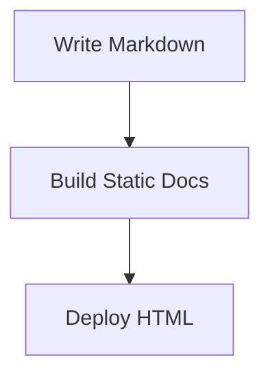

# Authoring

## Page frontmatter

Add YAML frontmatter at the top of any Markdown page:

```yaml
---
title: Components
description: Built-in documentation components.
nav_title: Components
badge: Guide
status: beta
hide_toc: false
hide_sidebar: false
order: 3
draft: false
---
```

You get:

:::badges
::badge label="Guide" type="info"
::badge label="Beta" type="warning"
:::

:::params
::param name="title" type="string" description="Page title and browser title."
::param name="description" type="string" description="Meta description, page summary, search text, and OpenGraph description."
::param name="nav_title" type="string" description="Optional shorter label for sidebar navigation."
::param name="badge" type="string" description="Small badge shown beside the page title."
::param name="status" type="new | beta | deprecated" description="Status pill shown beside the page title."
::param name="hide_toc" type="boolean" description="Hide the right-side table of contents."
::param name="hide_sidebar" type="boolean" description="Hide the left sidebar on a page."
::param name="draft" type="boolean" description="Exclude the page from the build."
:::

## Headings

Markdown headings create:

- anchor links
- right-side table of contents entries
- search index heading results

Hover over a heading and click the anchor icon to copy a section link.

## Code blocks

Write:

````md
```python title="hello.py" hl_lines="2"
def hello(name: str) -> str:
    return f"Hello {name}"
```
````

You get syntax highlighting, an optional file title, highlighted lines, and a copy button.

```python title="hello.py" hl_lines="2"
def hello(name: str) -> str:
    return f"Hello {name}"
```

## Images

Reference local images with standard Markdown. Static Docs copies local image files next to the generated page output.

```md

```

External image URLs are left unchanged.

## Mermaid

Write:

````md

````

You get:


