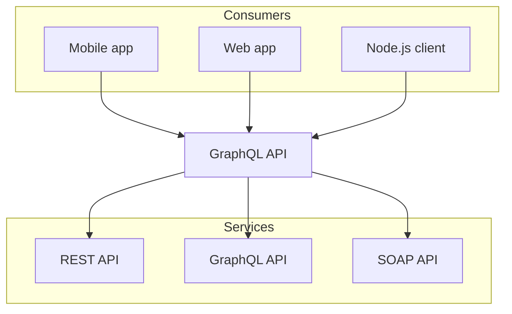

# Authoring

Static Docs pages are Markdown files with optional front matter.

## Page metadata

```yaml
---
title: Architecture
description: Explains the rendering pipeline.
badge: Guide
status: beta
hide_toc: false
hide_sidebar: false
order: 4
---
```

Use `status: new`, `status: beta`, or `status: deprecated` to show a status badge beside the page title.

Use headings to generate the right side table of contents.


